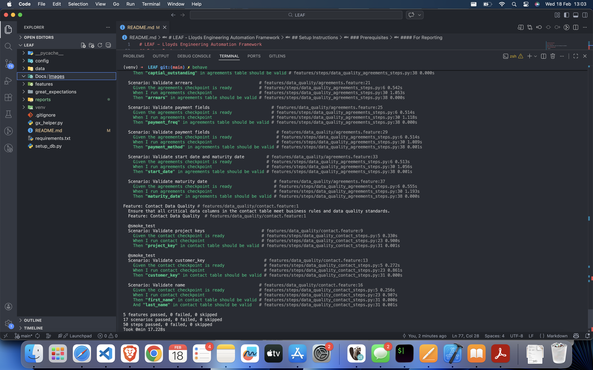
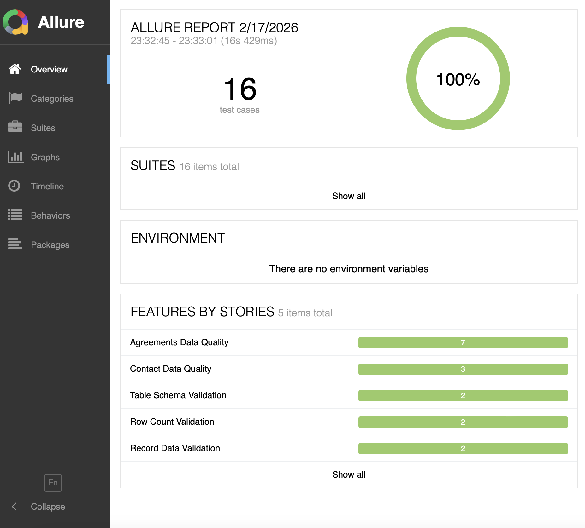
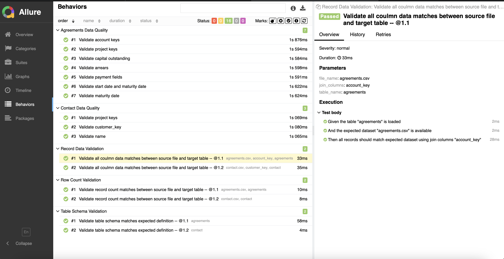
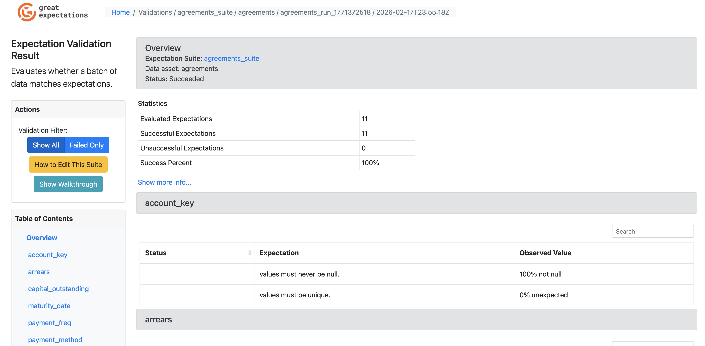
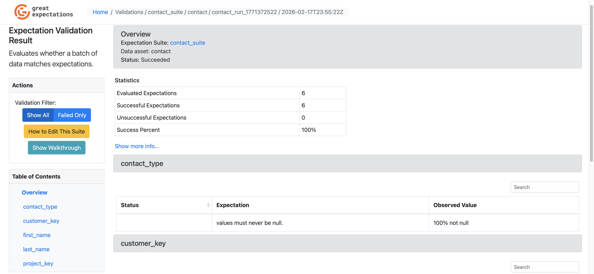

# LEAF - Lloyds Engineering Automation Framework

LEAF is a Python-based BDD automation framework using **Behave** and **Great Expectations**.


## Overview

LEAF provides automated checks to ensure data loaded into target tables is complete, conforms to expected quality rules, and matches the agreed schema contract. It is designed to be configuration-driven and easy to extend.

The framework validates:

- Source CSV vs Target Database (completeness check)

- Column-level data quality rules

- Schema consistency validation

Execution flow:

CSV → Load to DB → Behave Scenarios → Great Expectations Validation → Allure Report 

## Technology Stack
#### Programming Language
- Python 

#### Test Frameworks

- Behave – BDD execution

- Great Expectations – Data validation engine

- Allure – Test reporting

- DataComPy – Dataset comparison

#### Database

- PostgreSQL

#### External Python Modules

- psycopg2 – PostgreSQL connectivity

- pandas – Data processing and transformation

- sqlalchemy – Database abstraction layer

- pyyaml – Configuration file parsing


## Setup Instructions

### Prerequisites

Before running LEAF, ensure the following are available:

#### System Requirements

- Python3

- pip

- Git

#### Database

- PostgreSQL installed and running

- User credentials with permission to create tables and insert data

#### For Reporting

- Allure CLI installed and available on PATH

- Java (required by Allure)

### 1. Clone the Repository
    git clone https://github.com/pri-marge/LEAF.git
    cd LEAF


### 2. Create Virtual Environment

From the project root, run:

```bash
# Mac/Linux
python3 -m venv venv
source venv/bin/activate

# Windows
python -m venv venv
venv\Scripts\activate.bat
```

Then install dependencies:

```bash
pip install --upgrade pip
pip install -r requirements.txt
```

### 3. Update Database Configuration

Edit `config/config.yml` and update your Postgres database connection details:

```yaml
database:
  host: localhost
  port: 5432
  name: your_db_name
  user: your_user
  password: your_password
```

### 4. Setup Test Data

Create tables and load CSV data for testing:

```bash
python setup_db.py
```

### 5. Run Behave Tests

```bash
# Run BDD scenarios
behave --format=pretty 

# Run BDDonly smoke test scenarios
behave --tags=smoke_test
```

### 6. Generate Allure Report

```bash
# Run tests with Allure formatter
behave -f allure_behave.formatter:AllureFormatter -o reports/allure-results

# Generate HTML report
allure generate reports/allure-results -o reports/allure-report --clean

# Open report in browser
allure open reports/allure-report
```

## Execution Evidence

### Behave Test Execution


### Allure Report Summary




### Great Expectations Data Docs



